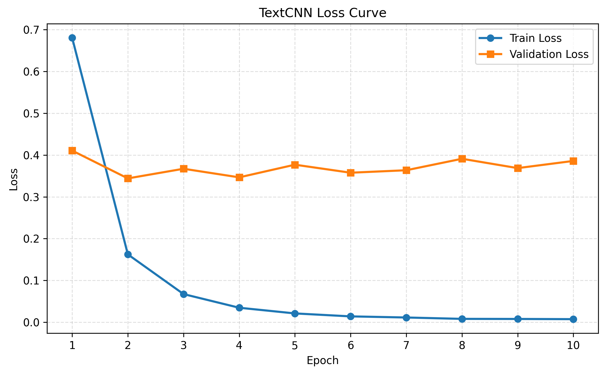
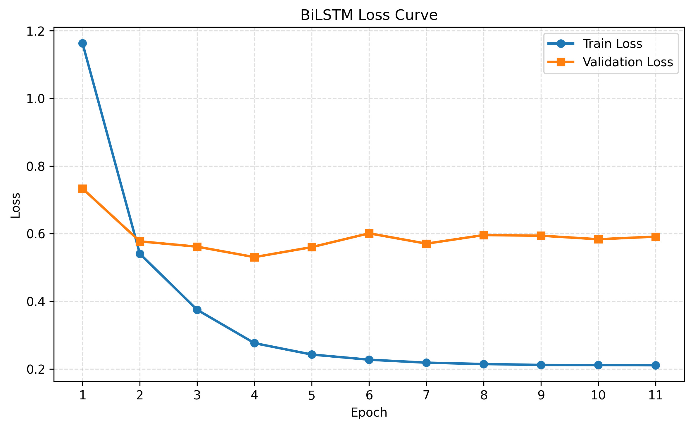

# NLP Text Classification Experiment

基于 `TextCNN` 和 `BiLSTM` 的中文新闻文本分类实验项目。

项目当前提供：

- `TextCNN.ipynb`：TextCNN 文本分类实验 notebook
- `BiLSTM.ipynb`：BiLSTM 文本分类实验 notebook
- `Data/`：训练集、验证集、测试集与类别文件
- `figures/`：训练过程中生成的 loss 曲线图
- `saved_dict/`：训练得到的模型参数与词表
- `实验报告.docx`：实验报告

## 项目结构

```text
experiment2/
├─ BiLSTM.ipynb
├─ TextCNN.ipynb
├─ README.md
├─ Data/
│  ├─ train.txt
│  ├─ dev.txt
│  ├─ test.txt
│  └─ class.txt
├─ figures/
│  ├─ BiLSTM_loss_curve.png
│  └─ TextCNN_loss_curve.png
└─ saved_dict/
   ├─ my_BiLSTM.pt
   ├─ my_TextCNN.pt
   └─ my_textcnn_vocab.pkl
```

## 数据说明

- `train.txt`：训练集
- `dev.txt`：验证集
- `test.txt`：测试集
- `class.txt`：类别名称

当前任务共 `4` 个类别：

- `finance`
- `realty`
- `education`
- `science`

## 模型说明

### TextCNN

- 字符级切分
- 多卷积核提取局部 `n-gram` 特征
- 最大池化后进行分类
- 已加入 `AdamW`、`weight decay`、`label smoothing`、学习率调度与早停

### BiLSTM

- 字符级切分
- 双向 LSTM 建模上下文信息
- 拼接双向隐藏状态进行分类
- 已加入 `AdamW`、梯度裁剪、学习率调度与早停

## 运行环境

建议使用 Python 3，并安装以下依赖：

```bash
pip install torch numpy scikit-learn matplotlib tqdm jupyter
```

## 使用方法

1. 打开 `TextCNN.ipynb` 或 `BiLSTM.ipynb`
2. 按顺序运行 notebook 中的单元
3. 训练结束后会自动：
   - 保存最优模型到 `saved_dict/`
   - 保存 loss 折线图到 `figures/`
   - 输出测试集分类结果

## 当前结果

根据 notebook 中已保存的训练结果：

| Model | Test Loss | Test Accuracy |
| --- | ---: | ---: |
| TextCNN | 0.2836 | 0.8875 |
| BiLSTM | 0.4751 | 0.8675 |

从当前结果看，`TextCNN` 在该短文本分类任务上的表现优于 `BiLSTM`。

## Loss 曲线

### TextCNN



### BiLSTM



## 说明

- 本项目以课程实验为目的整理
- notebook 中保留了训练输出、测试结果和画图代码
- 若重新训练，结果会随着随机种子、设备环境和超参数调整略有变化
